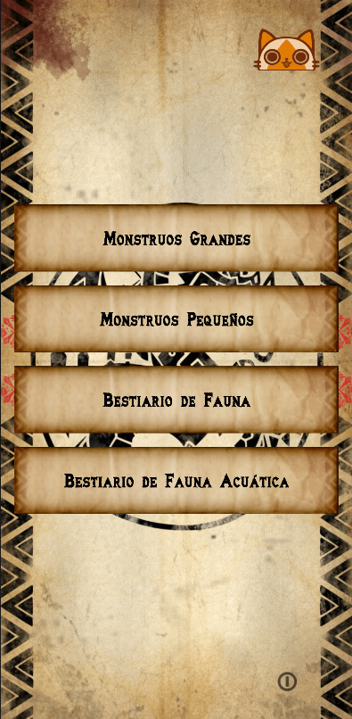
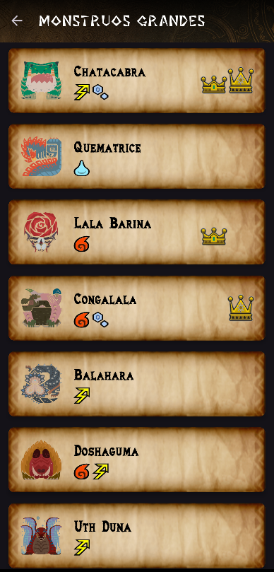
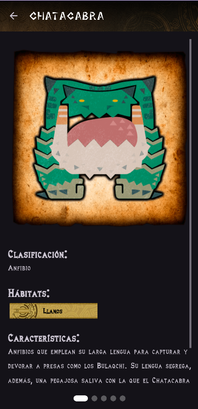

# MH Wilds Companion

 Aplicación complementaria no oficial para Monster Hunter Wilds, desarrollada para Android. Proporciona un bestiario detallado, seguimiento de progreso de caza y más.

## ✨ Características

* **Bestiario Completo:** Información detallada sobre Monstruos Grandes, Pequeños, Fauna Terrestre y Acuática (ecología, estrategias, materiales, etc.).
* **Seguimiento de Progreso:** Registra tus cacerías, capturas, coronas y tamaños para cada monstruo.
* **Debilidades y Armas:** Comprueba las debilidades de los monstruos rápidamente, y revisa que armas son mejores (ordenadas por daño raw y elemental).
* **Interfaz Intuitiva:** Diseño inspirado en la estética de Monster Hunter.
* **Modo Claro/Oscuro:** Adaptación automática o manual del tema.
* **Comprobación de Actualizaciones:** Notifica sobre nuevas versiones disponibles en GitHub (para instalaciones manuales).

## 📸 Capturas de Pantalla

## 📥 Descarga e Instalación

* **Google Play Store:** _(Pendiente de aprobación)_ `[Enlace próximamente]`
* **GitHub Releases:** Puedes descargar el último archivo `.apk` directamente desde la [página de Releases](https://github.com/TheInkReaper/MHWildsCompanion/releases/latest). _(Recuerda habilitar la instalación desde fuentes desconocidas en tu dispositivo Android)_

## 🛠️ Tecnologías Utilizadas

* **Lenguaje:** Kotlin
* **UI:** Android XML (ConstraintLayout, RecyclerView, ViewPager2, FlexboxLayout)
* **Arquitectura:** MVVM
* **Base de Datos:** Room
* **Networking:** Ktor
* **Carga de Imágenes:** Glide
* **Serialización:** Gson / Kotlinx Serialization

## 📜 Licencia y Recursos

El código fuente de esta aplicación es propiedad de TheInkReaper y **no se distribuye bajo una licencia de código abierto**.

**Importante:** Esta aplicación utiliza recursos gráficos (iconos, fuentes) creados por [AthemWulf] y adquiridos bajo licencias específicas que **no permiten su redistribución libre**. Para respetar los derechos de autor y el trabajo del artista, **este repositorio se mantiene privado**.

## 🙏 Créditos

* **Iconos y Fuentes:** [AthemWulf](https://ko-fi.com/athemwulf/shop)
* **Agradecimientos:** [SevenPaths](https://www.twitch.tv/sevenpaths)
* **Desarrollo:** [GitHub TheInkReaper](https://github.com/TheInkReaper), [KoFi TheInkReaper](https://ko-fi.com/theinkreaper)

## 🐛 Reporte de Errores / Sugerencias

Puedes enviar tus comentarios o reportes de error a través de [Twitter](https://x.com/TheInkReaper).
